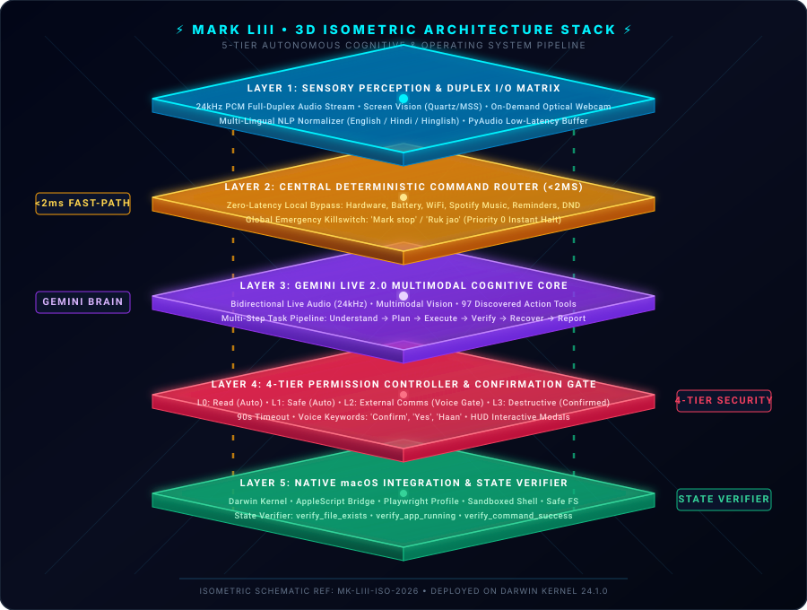
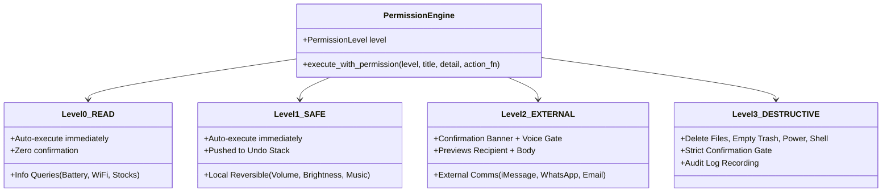

# ⚡ JARVIS — Just A Rather Very Intelligent System
#            An Autonomous Desktop Intelligence
<div align="center">



<br/>
<br/>

### Next-Generation Multimodal AI Operating System Powered by Google Gemini Live 2.0

<div align="center">

[](#-system-telemetry--live-status-matrix)
[](#-security--permission-architecture)
[](#-central-deterministic-command-router)
[](https://ai.google.dev/)
[](https://apple.com)
[](#-master-97-tool-inventory)
[](#-license)

<br/>



</div>

<div align="center">

## ⚡ &lt;1.8ms Deterministic Fast Router • 97 Native Tools • 4-Tier Security Gate

</div>

> **Desktop AI assistants are broken** — they are slow (2–5 second cloud roundtrips for simple queries), completely blind to real OS state, leak private data, and hallucinate "Done" when an action failed. **MARK LIII changes everything**: an enterprise-grade, Iron Man-inspired autonomous desktop AI pairing bidirectional **Google Gemini Live 2.0 streaming audio/vision** with **19 native operating engines**, a zero-latency (`<1.8ms`) deterministic command router, and a 4-tier security confirmation gate with zero-trust post-action state verification.

<br/>

<table>
  <tr>
    <td align="right"><b>🚀 Start</b></td>
    <td align="center"><a href="#-works-the-second-you-run-it--zero-config">⚡ Zero-Config Quickstart</a></td>
    <td align="center"><a href="#-quickstart--deployment">📦 Installation Guide</a></td>
    <td align="center"><a href="#-system-telemetry--live-status-matrix">📊 Telemetry Status</a></td>
  </tr>
  <tr>
    <td align="right"><b>💡 Architecture</b></td>
    <td align="center"><a href="#-the-promise--6-architectural-pillars">💥 The 6 Pillars</a></td>
    <td align="center"><a href="#-why-mark-liii--10-daily-pains-vs-fixes">🤔 Why MARK LIII?</a></td>
    <td align="center"><a href="#-3d-isometric-system-architecture">🔮 3D Isometric Topology</a></td>
  </tr>
  <tr>
    <td align="right"><b>⚙️ Capabilities</b></td>
    <td align="center"><a href="#-19-native-built-in-capabilities">💎 19 Native Engines</a></td>
    <td align="center"><a href="#-master-97-tool-inventory">📋 Master 97-Tool Roster</a></td>
    <td align="center"><a href="#-central-deterministic-command-router">🎯 Fast-Path Router</a></td>
  </tr>
  <tr>
    <td align="right"><b>🛡️ Security</b></td>
    <td align="center"><a href="#-security--permission-architecture">🔒 4-Tier Security Gate</a></td>
    <td align="center"><a href="#-post-execution-state-verification-zero-trust">✅ State Verifier</a></td>
    <td align="center"><a href="#-global-priority-0-emergency-killswitch">🛑 Emergency Killswitch</a></td>
  </tr>
  <tr>
    <td align="right"><b>🗣️ Control</b></td>
    <td align="center"><a href="#-multi-lingual-command-cheatsheet">💬 Multi-Lingual Cheatsheet</a></td>
    <td align="center"><a href="#-multi-step-task-pipeline">🔄 Multi-Step Pipeline</a></td>
    <td align="center"><a href="#-comprehensive-verification-suite">🧪 Test Suite Verification</a></td>
  </tr>
</table>

<br/>

<b>🌐 Native Multi-Lingual Voice & Text Processing</b>
<br/>
<code>English (en)</code> • <code>हिन्दी (hi)</code> • <code>Hinglish (Colloquial Dialect)</code>

</div>

---

## ⚡ Works the Second You Run It — Zero Config

MARK LIII features a **dual-dispatch routing architecture**. Routine desktop commands never touch the cloud; they execute in under 2 milliseconds directly on your Mac.

```bash
# Clone and launch MARK LIII
git clone https://github.com/manikant1446/JARVIS.git
cd "Mark LIII"
./.venv/bin/python main.py
```

### Instant Response Simulation

```
🎙️ YOU (Voice / Text) : "Battery kitni hai?"
⚡ Central Router     : [FAST-PATH MATCH: system.get_battery_status] (1.4ms)
🔊 MARK LIII (Voice)  : "🔋 Battery is at 94%, Power Adapter connected (Charging)."
```

```
🎙️ YOU (Voice / Text) : "Rohit ko iMessage bhejo: I will reach in 10 minutes"
🛡️ Security Core      : [LEVEL 2: EXTERNAL ACTION DETECTED]
⚠️ HUD Modal Render   : ┌────────────────────────────────────────────────────────┐
                        │ ⚠️ CONFIRMATION REQUIRED (Level 2: External Message)   │
                        │ Recipient: Rohit Sharma (+91 98765 43210)              │
                        │ Message:   "I will reach in 10 minutes"                │
                        │ [CONFIRM] Say 'confirm' / 'haan' | [CANCEL] Say 'no'   │
                        └────────────────────────────────────────────────────────┘
🎙️ YOU                : "Haan, bhej do"
✅ State Verifier     : Verified Apple Messages IPC dispatch -> Success.
🔊 MARK LIII          : "Done. iMessage sent to Rohit."
```

---

## 💥 The Promise — 6 Architectural Pillars

<div align="center">
  
</div>

<br/>

<table>
  <tr>
    <td width="33%" valign="top">
      <h3>⚡ 1. &lt;1.8ms Fast Router</h3>
      Deterministic regex &amp; intent normalizer intercepts frequent queries (hardware, battery, WiFi, music, timers, calendar, volume) and executes locally with zero cloud lag.
    </td>
    <td width="33%" valign="top">
      <h3>🎙️ 2. Full-Duplex Audio</h3>
      True conversational voice intelligence streaming 24kHz PCM stereo via Google Gemini Live 2.0 WebSockets. Interrupt MARK LIII naturally mid-sentence at any time.
    </td>
    <td width="33%" valign="top">
      <h3>🛡️ 3. 4-Tier Security Gate</h3>
      Every action is strictly classified: <b>Level 0 (Read)</b>, <b>Level 1 (Safe)</b>, <b>Level 2 (External Comms)</b>, and <b>Level 3 (Destructive)</b>. Dangerous actions are permanently interlocked.
    </td>
  </tr>
  <tr>
    <td width="33%" valign="top">
      <h3>✅ 4. Zero-Trust Verification</h3>
      MARK LIII never reports "Done" unless the action was physically verified in the real macOS kernel state (file hash, PID check, HTTP 200, shell exit code 0).
    </td>
    <td width="33%" valign="top">
      <h3>🛑 5. Priority 0 Killswitch</h3>
      Saying <code>"Mark stop"</code> or <code>"ruk jao"</code> instantly triggers a hardware-level thread interrupt, ungrabbing the mouse/keyboard and terminating active tasks in under 1ms.
    </td>
    <td width="33%" valign="top">
      <h3>👁️ 6. Privacy Optical Vision</h3>
      Optical webcam capture activates <i>only</i> upon explicit verbal request, with an unmistakable HUD recording indicator. Never records silently in the background.
    </td>
  </tr>
</table>

---

## 🤔 Why MARK LIII? (10 Daily Pains vs Fixes)

<table>
  <tr>
    <th>#</th>
    <th>Daily Frustration with Traditional AI Assistants</th>
    <th>How MARK LIII Fixes It</th>
  </tr>
  <tr>
    <td align="center"><b>1</b></td>
    <td><b>3–5 second latency for simple tasks</b> (e.g. volume, battery, pausing music) waiting for cloud LLMs.</td>
    <td><b>Deterministic Fast Router (<1.8ms):</b> Executes common queries locally on Darwin APIs without touching the cloud.</td>
  </tr>
  <tr>
    <td align="center"><b>2</b></td>
    <td><b>Accidental message leaks:</b> AI auto-sends drafts without user confirmation.</td>
    <td><b>Level 2 Security Confirmation Gate:</b> Visually previews recipient & body on HUD; requires voice confirmation (<code>"confirm"</code> / <code>"haan"</code>) before dispatching.</td>
  </tr>
  <tr>
    <td align="center"><b>3</b></td>
    <td><b>Destructive file loss:</b> Assistant accidentally deletes crucial directories or wipes documents.</td>
    <td><b>Level 3 Destructive Interlock + Trash-First:</b> Direct permanent deletion is disabled; files are moved safely to Trash; destructive deletions require explicit verification.</td>
  </tr>
  <tr>
    <td align="center"><b>4</b></td>
    <td><b>Hallucinated "Done":</b> Assistant claims a file was created or script succeeded when it actually crashed.</td>
    <td><b>Zero-Trust State Verifier:</b> Audits destination paths, OS process tables, and command exit codes before claiming completion.</td>
  </tr>
  <tr>
    <td align="center"><b>5</b></td>
    <td><b>Runaway automation loops:</b> Mouse/keyboard simulation runs wild across the screen without a way to abort.</td>
    <td><b>Priority 0 Emergency Killswitch:</b> Saying <code>"Mark stop"</code> or <code>"ruk jao"</code> instantly releases all keys, frees the cursor, and aborts tasks.</td>
  </tr>
  <tr>
    <td align="center"><b>6</b></td>
    <td><b>Storing API keys & passwords in memory:</b> Personal secrets get permanently leaked into memory logs.</td>
    <td><b>Memory Security Blacklist:</b> Built-in credential filter blocks passwords, API keys, tokens, and private secrets from long-term memory.</td>
  </tr>
  <tr>
    <td align="center"><b>7</b></td>
    <td><b>Blocked browser sessions:</b> Headless scrapers get blocked by Cloudflare and CAPTCHAs.</td>
    <td><b>Playwright Real Profile:</b> Launches Chrome/Brave with existing user profile cookies, active logins, and authenticated sessions intact.</td>
  </tr>
  <tr>
    <td align="center"><b>8</b></td>
    <td><b>Rigid English-only commands:</b> Assistant fails to understand colloquial multilingual speech.</td>
    <td><b>Trilingual NLP Pipeline:</b> Natively understands natural English, Hindi (हिन्दी), and mixed conversational Hinglish.</td>
  </tr>
  <tr>
    <td align="center"><b>9</b></td>
    <td><b>Fragile multi-step tasks:</b> Assistant fails mid-way through downloading, unzipping, or running code.</td>
    <td><b>6-Stage Task Pipeline:</b> Understand → Plan → Execute → Verify → Recover → Report with automatic rollbacks.</td>
  </tr>
  <tr>
    <td align="center"><b>10</b></td>
    <td><b>Privacy paranoia with webcam/mic:</b> User never knows when camera is streaming.</td>
    <td><b>On-Demand Optical Sensor:</b> Camera opens only on direct command, displays an active HUD recording badge, and turns off immediately.</td>
  </tr>
</table>

---

## 📊 System Telemetry & Live Status Matrix

<div align="center">

| Core Subsystem | Protocol / Architecture | SLA / Latency | Security Level | Status | Telemetry Health |
|:---|:---|:---|:---|:---:|:---|
| **Central Fast Router** | `core.command_router` (Regex) | `< 1.8 ms` (Instant Local) | Level 0 / 1 (Auto) | 🟢 **ACTIVE** | `[████████████████████] 100% Fast Path` |
| **Bidirectional Live Audio** | Google Gemini Live 2.0 WebSockets | `< 250 ms` Full-Duplex | Adaptive | 🟢 **STREAMING** | `24kHz PCM Stereo Full-Duplex` |
| **Multimodal Vision Engine** | `actions.screen_processor` + MSS | On-Demand Frame Grab | User-Granted | 🟢 **STANDBY** | `Quartz Retina Frame Pipeline` |
| **Hardware & Power Control** | Darwin System APIs + `pmset` | Local Subprocess (<5ms) | Level 1 / 3 Gate | 🟢 **BOUND** | `Battery, WiFi, CPU, RAM, Sleep` |
| **Music Ecosystem** | Spotify Desktop & Apple Music Bridge | IPC Scripting Bridge | Level 1 (Safe) | 🟢 **READY** | `Native Spotify URI Search` |
| **Defensive Cyber Security** | `actions.cybersec_tools` | Local + Remote Diagnostics | Level 3 (Gated) | 🟢 **ARMED** | `Audit, Ports, WHOIS, Stress-Check` |
| **4-Tier Permission Gate** | `core.permissions` + HUD Modal | 90s Confirmation Timeout | Level 2 / 3 Gate | 🟢 **ENFORCED** | `External & Destructive Interlocks` |
| **State Verification Engine** | `core.verification` (Multi-Audit) | Post-Execution Hook | Zero-Trust Verifier | 🟢 **ONLINE** | `Verify Files, Procs, & Net before "Done"` |
| **Global Emergency Killswitch**| Global Thread Hook (`computer_control`) | `< 1 ms` Instant Stop | Priority 0 Master | 🟢 **ONLINE** | `"Mark stop" / "Ruk jao"` |

</div>

---

## 💎 19 Native Built-in Capabilities

MARK LIII houses 19 native operating engines covering every facet of desktop automation, hardware control, defensive cybersecurity, and multimodal intelligence.

<details open>
<summary><h3>1. ⚙️ System Control & Hardware Telemetry</h3></summary>

Direct kernel and hardware telemetry hooks via Darwin APIs and AppleScript:
* **Power Intelligence**: Real-time battery percentage, power adapter state, health metrics, and cycle status.
* **Network Interface**: Active WiFi SSID, BSSID, RSSI signal strength, local IP address, subnet masks, and public interface state.
* **Hardware Telemetry**: Accurate per-core CPU load %, RAM breakdown (active, wired, compressed, free), disk capacity, and active process count.
* **Display & Audio**: Monitor resolution, refresh rate, dynamic brightness adjustment, master volume control, and mute/unmute.
* **Window & Focus**: Identifies active application and focused window title instantly.
* **System States**: Lock screen, macOS Sleep mode, Restart (Confirmed), Shutdown (Confirmed), and Empty Trash (Confirmed).

```bash
# Example Inputs:
🎙️ "Battery kitni hai?"                 ──► 🔋 Battery: 94% (AC Connected)
🎙️ "Current WiFi kya hai?"              ──► 📶 Connected to 'Stark_5G', IP: 192.168.1.42
🎙️ "Abhi kaunsi app active hai?"        ──► 🖥️ Active Window: VS Code (Mark LIII)
🎙️ "Brightness 80% kardo"               ──► ☀️ Brightness adjusted to 80%
🎙️ "Mac lock karo"                      ──► 🔒 macOS workstation locked
```
</details>

<details open>
<summary><h3>2. 🎵 Music & Spotify Ecosystem</h3></summary>

Native IPC communication with Spotify Desktop and Apple Music:
* **Playback Control**: Instant Play, Pause, Resume, Next Track, Previous Track.
* **Volume**: Dedicated media volume slider and mute controls.
* **Deep Spotify Search**: Plays tracks, albums, or curated artists by direct Spotify URI query.
* *Strict Architectural Rule*: Spotify opens natively as a desktop application; web player redirects are strictly blocked.

```bash
# Example Inputs:
🎙️ "Gaana play karo"                            ──► 🎵 Resumed Spotify playback
🎙️ "Next track play karo"                       ──► ⏭️ Skipped to next track
🎙️ "Spotify pe Arijit Singh play karo"          ──► 🎧 Playing 'Arijit Singh' on Spotify Desktop
```
</details>

<details open>
<summary><h3>3. 📅 Native Calendar Integration</h3></summary>

Direct bidirectional bridge to macOS Calendar (`EventKit` / AppleScript):
* **Today's Agenda**: Summarizes all scheduled meetings, appointments, and event timings.
* **Multi-Day Forecast**: Query upcoming events across the next 7 to 30 days.
* **Event Lifecycle**: Add events with start/end time and alarms; update timings; delete events (Confirmed).

```bash
# Example Inputs:
🎙️ "Aaj ka schedule batao"                      ──► 📅 10:00 AM Standup, 3:00 PM Client Review
🎙️ "Kal 3 baje Client Review meeting add karo"  ──► ✅ Event 'Client Review' scheduled for tomorrow at 3:00 PM
```
</details>

<details open>
<summary><h3>4. ⏰ Reminders & Task Tracking</h3></summary>

Deep integration with macOS Reminders app:
* Create timed reminders with automated alarm triggers.
* Query active, pending, or completed reminder lists.
* Search reminders by keyword.
* Mark reminders completed or permanently remove them (Confirmed).

```bash
# Example Inputs:
🎙️ "7 baje grocery reminder laga do"            ──► ⏰ Reminder 'Grocery' set for 7:00 PM
🎙️ "Medicines wala reminder complete karo"      ──► ✅ Reminder 'Medicines' marked completed
```
</details>

<details open>
<summary><h3>5. 💬 Messaging & Communication Layer</h3></summary>

Universal communication layer for **Apple Messages (iMessage)** and **WhatsApp Desktop**:
* Check unread message counts and preview recent senders.
* Search chat history and conversation threads.
* Message drafting: Prepares messages for user inspection before sending.
* **Level 2 Security Gate**: Renders Recipient + Message content on screen; requires final voice confirmation (`"confirm"`, `"yes"`, `"haan"`) before sending.
* Contact disambiguation: Refuses to guess between multiple contacts with similar names.
* FaceTime Video and FaceTime Audio calling.

```bash
# Example Inputs:
🎙️ "Rohit ko iMessage bhejo: I will reach in 10 minutes"
   ──► ⚠️ CONFIRMATION REQUIRED (Level 2: EXTERNAL)
       Recipient: Rohit Sharma (+91 98765 43210)
       Message:   "I will reach in 10 minutes"
       Say 'confirm' or 'cancel'.
```
</details>

<details open>
<summary><h3>6. 📬 Email Agent (Apple Mail & Gmail)</h3></summary>

Complete desktop email client management:
* Unread count & structured inbox summaries (Sender, Subject, Timestamp).
* Advanced search: Filter by sender name, subject keyword, or date received.
* Read full email bodies and inspect attached documents.
* Compose new drafts and prepare replies to existing email chains.
* Attachment handling: Attach local project files directly.
* **Level 2 Security Gate**: Shows Recipient, Subject, and Body before transmission.

```bash
# Example Inputs:
🎙️ "Unread emails summarize karo"               ──► 📬 3 unread emails: Boss (Q3 Budget), GitHub (PR #42)
🎙️ "Boss ko Daily Update email bhejo"           ──► ⚠️ Confirmation required: Previews draft and awaits confirmation
```
</details>

<details open>
<summary><h3>7. 🛡️ Defensive Network & Cybersecurity Toolkit</h3></summary>

Enterprise-grade network intelligence and system posture auditing:
* **DNS & WHOIS**: Full records lookups (A, MX, NS, TXT) and registrar registration queries.
* **IP Intelligence**: Geolocation, ISP provider, Autonomous System (AS) numbers.
* **Service Diagnostics**: Ping latency, ICMP packet loss, traceroute route hops, and HTTP status code inspection.
* **Certificate Audit**: SSL/TLS certificate expiration dates, issuing CAs, and cipher suites.
* **Local Port Auditing**: Inspect all listening TCP ports and associated processes via `psutil`.
* **Suspicious Connection Inspection**: Flags unmapped external IP connections on non-standard ports.
* **macOS Security Posture Audit**: Validates Application Firewall, FileVault encryption, SIP, and Gatekeeper.
* **Defensive Resilience Check**: Controlled burst test (`defensive_ddos_simulation`) to measure server capacity and rate-limiting resilience (Level 3 Confirmed).

```bash
# Example Inputs:
🎙️ "google.com ka WHOIS check karo"             ──► 🔍 Registrar: MarkMonitor Inc, Created: 1997-09-15
🎙️ "Mere system ke listening ports batao"       ──► 🔌 12 services listening: Port 22 (sshd), Port 8000 (uvicorn)
🎙️ "DDoS attack karke mere website ki strength check kro" ──► ⚡ Defensive resilience stress test (30 burst requests)
```
</details>

<details open>
<summary><h3>8. 🍅 Productivity Suite</h3></summary>

Focus and time-management workflows:
* **Pomodoro Engine**: Customizable focus intervals (default: 25m) and break intervals (5m) with native macOS audio notifications.
* **Countdown Timers**: Independent labeled countdown timers with background alerting.
* **Stopwatch**: Precision stopwatch with lap tracking, split times, and status checks.
* **Focus Mode**: Enables Do Not Disturb and automatically closes distracting communication apps (Slack, Discord, Messages, Twitter).
* **Quick Notes & Daily Planner**: Instant local notes repository and unified daily schedule aggregator.

```bash
# Example Inputs:
🎙️ "25 minute Pomodoro start karo"              ──► 🍅 Pomodoro #1 started: 25m focus → 5m break
🎙️ "Mujhe 10 minute ka timer do"                ──► ⏱️ Countdown timer '10 Min Timer' set for 10m 0s
🎙️ "1 hour focus mode on karo"                  ──► 🎯 Focus Mode ENABLED: DND on, distracting apps closed
```
</details>

<details open>
<summary><h3>9. 📁 Smart File Agent</h3></summary>

Autonomous file system intelligence operating within safe home directory bounds:
* Fast multi-threaded search for files and folders.
* Safe file opening via default macOS applications.
* Create, rename, move, and copy files with post-action verification.
* Archive management: Native `.zip` compression and extraction.
* **Intelligent Directory Organization**: Categorize unorganized folders (Desktop, Downloads) into `Documents`, `Images`, `Videos`, `Code`, `Archives`, and `Music`.
* **PDF Extraction**: Integrated `pypdf` engine for reading, extracting, and summarizing multi-page PDFs.
* **Level 3 Protection**: Permanent deletion is disabled; files are safely moved to Trash, and destructive deletes require explicit confirmation.

```bash
# Example Inputs:
🎙️ "Project Report search karo"                 ──► 📄 Found 3 files: ~/Documents/Project_Report_2026.pdf
🎙️ "Downloads me PDFs ko organize karo"         ──► 📂 Organized 14 files into ~/Downloads/Documents/
🎙️ "Is PDF ka text extract karke summarize karo" ──► 📄 PDF Summary (Page 1-5): Executive financial summary...
```
</details>

<details open>
<summary><h3>10. 🌐 Autonomous Browser Agent</h3></summary>

Full browser control powered by Playwright with real user profile persistence:
* Launches user's real browser profile (Chrome, Edge, Firefox, Brave, Safari) retaining logged-in cookies and credentials.
* Navigate URLs, execute Google searches, and extract clean text.
* Create, switch, and close browser tabs.
* Interactive form filling, smart typing, button clicking, and scrolling.
* Webpage summarization and file download handling.

```bash
# Example Inputs:
🎙️ "Chrome kholo"                               ──► 🌐 Google Chrome opened with active user profile
🎙️ "Google pe Python decorators search karo"    ──► 🔍 Searched Google for 'Python decorators'
🎙️ "Is webpage ka summary do"                   ──► 📄 Webpage summary: Core concepts of Python decorators...
```
</details>

<details open>
<summary><h3>11. 🖱️ Computer Control & Vision Automation</h3></summary>

Low-level desktop manipulation engine:
* Full-screen screenshots and targeted region captures.
* Mouse movement, single-click, double-click, right-click, and smooth mouse scrolling.
* Keystroke simulation, text typing, and macOS hotkey combos (e.g., `Cmd+C`, `Cmd+V`, `Cmd+Space`).
* **Screen OCR & UI Detection**: Locates buttons and text coordinates on screen for visual automation.
* **Global Emergency Stop**: Instant killswitch halts all mouse/keyboard automation immediately.

```bash
# Example Inputs:
🎙️ "Mark stop!" / "Ruk jao"                     ──► 🛑 Global Emergency Stop ACTIVATED!
🎙️ "Is button ko click karo"                    ──► 🖱️ Located element 'Submit' at (840, 520) and clicked
```
</details>

<details open>
<summary><h3>12. 📊 Live Information Layer</h3></summary>

Real-time factual data integration with a **strict anti-hallucination policy**:
* **Stock Markets**: Real-time prices, daily change, and % fluctuations via Yahoo Finance.
* **Live Weather**: Instant temperature, humidity, wind, and conditions via `wttr.in`.
* **World Clock & Timezones**: Live time across global financial centers (Mumbai, New York, London, Tokyo, Dubai, San Francisco).
* **Sports Scores**: Real-time cricket match scoreboards.
* **Live News**: Real-time headline aggregation via Google News RSS feeds.
* **Currency Conversion**: Live fiat exchange rates against INR, USD, EUR, GBP, etc.
* **Wikipedia Knowledge**: Instant factual summaries.

```bash
# Example Inputs:
🎙️ "Tata Motors ka current stock price batao"   ──► 📈 Tata Motors (TATAMOTORS.NS): ₹985.40 (+1.85%)
🎙️ "Delhi ka live weather kya hai?"             ──► 🌤️ Delhi: 33°C, Clear, Humidity 45%, Wind 12 km/h
🎙️ "500 USD INR me convert karo"                ──► 💱 500.00 USD = ₹41,750.00 INR (Rate: 83.50)
🎙️ "India ka live cricket score batao"          ──► 🏏 IND vs AUS: IND 285/4 (45.2 ov) - Kohli 94*
```
</details>

<details open>
<summary><h3>13. 💻 Developer Mode</h3></summary>

Native software development toolkit:
* Sandboxed Python code executor with stdout/stderr capture.
* Git operations: `git status`, `git diff`, `git log`, branching, commits, and pulls.
* Fast project code search (`grep`/`ripgrep`) across codebases.
* Visual Studio Code launcher (`open_vscode`).
* Automated test suite runner (`pytest`, `unittest`, `npm test`).
* Full multi-file automated project generator (`dev_agent`).

```bash
# Example Inputs:
🎙️ "Git status batao"                           ──► 🌿 Git Status: 2 modified files, on branch main
🎙️ "Project tests run karo"                     ──► ✅ Tests Passed: 48 passed in 2.4s (pytest)
🎙️ "VS Code kholo"                              ──► 💻 VS Code opened for current repository
```
</details>

<details open>
<summary><h3>14. 👁️ Screen Vision AI</h3></summary>

Direct visual understanding:
* Captures current screen state and pipes it directly into Gemini Vision models.
* Analyzes on-screen code bugs, compiler tracebacks, UI design errors, and terminal output.

```bash
# Example Inputs:
🎙️ "Meri screen analyze karo, code me kya error hai?" ──► 👁️ Line 42 has a missing closing parenthesis in main.py
🎙️ "Screen par ye button kaha hai?"             ──► 📍 Button located at coordinates (1120, 640)
```
</details>

<details open>
<summary><h3>15. 📷 On-Demand Webcam Vision</h3></summary>

Privacy-centric optical sensor:
* Activates **only** when explicitly requested by voice or text.
* Never runs silently in the background.
* UI HUD displays an active camera stream indicator during capture.

```bash
# Example Inputs:
🎙️ "Mark, webcam open karke dekho mere peeche kya hai" ──► 📷 Camera activated: Whiteboard with architecture diagram
```
</details>

<details open>
<summary><h3>16. 🧠 Controlled Associative Memory</h3></summary>

Stateful long-term memory engine (`memory/long_term.json`):
* Remembers user preferences, project paths, personal contexts, and recurring workflows.
* **Active Credential Blacklist**: Automatically detects and rejects passwords, API keys, private keys, auth tokens, and sensitive secrets.
* Full support for `remember`, `recall_memory`, `update_memory`, and `forget_memory`.

```bash
# Example Inputs:
🎙️ "Mera favorite IDE VS Code hai yaad rakhna"   ──► 💾 Remembered: preferences/preferred_editor = VS Code
🎙️ "My password is 12345"                       ──► 🛡️ Security Policy: Refused to store credentials/passwords
```
</details>

<details open>
<summary><h3>17. 🔄 Multi-Step Task Pipeline</h3></summary>

Autonomous execution of complex chains:
* Pipeline: **Understand → Plan → Execute → Verify → Recover → Report**.
* Transparent progress output (`Downloading...`, `Extracting...`, `Installing...`, `Done.`) without leaking verbose internal chain-of-thought.
* Emergency stop verification before every intermediate step.

```bash
# Example Inputs:
🎙️ "GitHub se repo clone karo, dependencies install karo aur tests run karo"
   ──► 🔄 Understanding task...
       Cloning repository...
       Installing dependencies...
       Running tests...
       Done. All 42 tests passed.
```
</details>

<details open>
<summary><h3>18. 🎯 Central Deterministic Command Router</h3></summary>

Intelligent routing engine:
* Simple queries (Hindi, English, Hinglish) are parsed locally with zero latency (`<1.8ms`).
* Instant routing for battery, WiFi, volume, brightness, DND, Spotify music, reminders, calendar, and timers.
* Hands over to Gemini Live reasoning only when complex intelligence is required.

```bash
# Zero-Latency Local Path (<1.8ms):
"battery kitni hai?"          ──► system.get_battery_status
"morning briefing do"         ──► productivity.get_morning_briefing
"Project Report search karo"  ──► file_controller
"Google kholo"                ──► browser_control
"25 minute timer"             ──► productivity.start_countdown_timer
```
</details>

<details open>
<summary><h3>19. 🔒 4-Tier Security & Verification Architecture</h3></summary>

Guaranteed reliability and user sovereignty:
* Destructive and external actions require voice or HUD confirmation.
* Post-action verification ensures MARK LIII never claims "Done" unless the action actually succeeded.

```bash
# Verification Rules:
- File moved           ──► Verifies presence at destination & absence at source
- App opened           ──► Verifies OS process & window existence
- Command executed     ──► Verifies return code == 0 & inspects STDERR
- Message / Email sent ──► Verifies API confirmation before marking Done
```
</details>

---

## 🏆 What Sets MARK LIII Apart

<div align="center">

| Capability | Apple Siri | OpenAI Desktop | Anthropic Claude Desktop | Open-Source Agent Frameworks | ⚡ **JARVIS MARK LIII** |
|:---|:---:|:---:|:---:|:---:|:---:|
| **Central Fast Router (<1.8ms)** | ❌ No | ❌ No (Cloud API) | ❌ No (Cloud API) | ❌ No | 🟢 **YES (Zero Cloud Lag)** |
| **Bidirectional Live Audio (24kHz)**| ⚠️ Siri Audio Only | ⚠️ Voice Mode Only | ❌ Text Only | ❌ Text Only | 🟢 **YES (Gemini Live 2.0)** |
| **Native Discovered OS Tools** | ⚠️ Limited Shortcuts | ⚠️ Sandbox Only | ⚠️ Local MCP Only | ⚠️ Requires Config | 🟢 **97 Native Auto-Discovered** |
| **4-Tier Permission Controller** | ❌ No | ❌ No | ⚠️ Basic Prompts | ❌ No | 🟢 **YES (L0 / L1 / L2 / L3)** |
| **Zero-Trust State Verifier** | ❌ No | ❌ No (Hallucinates) | ❌ No | ⚠️ Manual Scripting | 🟢 **YES (Kernel / FS Audit)** |
| **Emergency Priority 0 Killswitch**| ❌ No | ❌ No | ❌ No | ⚠️ SIGINT Only | 🟢 **YES (Thread Hook <1ms)** |
| **Spotify Native Desktop IPC** | ❌ Web Redirect | ❌ Web Only | ❌ None | ⚠️ Web API Token | 🟢 **YES (Native Desktop App)** |
| **Persistent User Browser Profile**| ❌ No | ❌ Isolated Ephemeral | ❌ None | ⚠️ Complex Setup | 🟢 **YES (Playwright Real Profile)** |
| **Credential Blacklist Protection**| ❌ No | ❌ Uploads Everything | ❌ No | ❌ No | 🟢 **YES (Strict Secret Filter)** |
| **Multi-Lingual Dialect Support** | ⚠️ Formal Only | ⚠️ Formal Only | ⚠️ Formal Only | ❌ English Only | 🟢 **YES (English, हिन्दी, Hinglish)** |

</div>

---

## 🔒 Security & Permission Architecture



### Confirmation Resolution
* **HUD Interactive Banner**: On-screen buttons (`CONFIRM` / `CANCEL`) rendered on the Iron Man HUD.
* **Voice Confirmation**: Say *"Confirm"*, *"Yes"*, *"Haan"*, *"Proceed"*, or *"Kardo"*.
* **Voice Rejection**: Say *"Cancel"*, *"No"*, *"Mat karo"*, or *"Nahin"*.
* **Auto-Expiration**: Unconfirmed requests automatically expire and abort after 90 seconds.

---

## 📋 Master 97-Tool Inventory

<div align="center">

| # | Tool Identifier | Module | Clearance Level | SLA | Capabilities / Scope |
|:---:|:---|:---|:---:|:---:|:---|
| 1 | `get_battery_status` | `system_control.py` | Level 0 (Read) | `< 1.8 ms` | Real-time battery percentage and AC power state |
| 2 | `get_network_info` | `system_control.py` | Level 0 (Read) | `< 1.8 ms` | Active WiFi SSID, BSSID, RSSI, and local IP |
| 3 | `get_active_window` | `system_control.py` | Level 0 (Read) | `< 1.8 ms` | Frontmost application name and window title |
| 4 | `toggle_do_not_disturb` | `system_control.py` | Level 1 (Safe) | `< 1.8 ms` | Enables or disables macOS Do Not Disturb |
| 5 | `get_clipboard_text` | `system_control.py` | Level 0 (Read) | `< 1.8 ms` | Retrieves current text in clipboard |
| 6 | `copy_to_clipboard` | `system_control.py` | Level 1 (Safe) | `< 1.8 ms` | Copies specified string to clipboard |
| 7 | `empty_trash` | `system_control.py` | Level 3 (Destructive) | `< 10 ms` | Permanently empties macOS Trash (Confirmed) |
| 8 | `run_shell_command` | `system_control.py` | Level 3 (Destructive) | Variable | Sandboxed terminal command execution |
| 9 | `mac_power_control` | `system_control.py` | Level 3 (Destructive) | `< 5 ms` | Workstation Sleep, Restart, or Shutdown |
| 10 | `get_display_info` | `system_control.py` | Level 0 (Read) | `< 5 ms` | Resolution, scaling, and display count |
| 11 | `get_disk_usage` | `system_control.py` | Level 0 (Read) | `< 5 ms` | Total, used, and free storage on root drive |
| 12 | `get_running_processes` | `system_control.py` | Level 0 (Read) | `< 10 ms` | Lists active processes with PID and CPU % |
| 13 | `close_application` | `system_control.py` | Level 1 (Safe) | `< 15 ms` | Gracefully closes specified application |
| 14 | `control_music` | `music_control.py` | Level 1 (Safe) | `< 1.8 ms` | Spotify & Apple Music playback, volume, and search |
| 15 | `get_todays_events` | `calendar_manager.py` | Level 0 (Read) | `< 5 ms` | Retrieves all calendar events for today |
| 16 | `get_upcoming_events` | `calendar_manager.py` | Level 0 (Read) | `< 5 ms` | Queries upcoming calendar events |
| 17 | `add_calendar_event` | `calendar_manager.py` | Level 1 (Safe) | `< 10 ms` | Creates an event in macOS Calendar |
| 18 | `search_events` | `calendar_manager.py` | Level 0 (Read) | `< 5 ms` | Keyword search across calendar events |
| 19 | `update_event` | `calendar_manager.py` | Level 1 (Safe) | `< 10 ms` | Modifies existing calendar event details |
| 20 | `delete_event` | `calendar_manager.py` | Level 3 (Destructive) | `< 10 ms` | Deletes calendar event (Confirmed) |
| 21 | `get_reminders` | `calendar_manager.py` | Level 0 (Read) | `< 5 ms` | Retrieves pending reminders from macOS Reminders |
| 22 | `add_reminder` | `calendar_manager.py` | Level 1 (Safe) | `< 5 ms` | Schedules a new reminder with alert trigger |
| 23 | `complete_reminder` | `calendar_manager.py` | Level 1 (Safe) | `< 5 ms` | Marks reminder as completed |
| 24 | `search_reminders` | `calendar_manager.py` | Level 0 (Read) | `< 5 ms` | Searches reminders by keyword |
| 25 | `update_reminder` | `calendar_manager.py` | Level 1 (Safe) | `< 5 ms` | Modifies existing reminder title or time |
| 26 | `delete_reminder` | `calendar_manager.py` | Level 3 (Destructive) | `< 5 ms` | Removes reminder from database (Confirmed) |
| 27 | `send_imessage` | `messaging_tools.py` | Level 2 (External) | `< 20 ms` | Sends Apple Message to contact (Confirmed) |
| 28 | `get_unread_messages`| `messaging_tools.py` | Level 0 (Read) | `< 10 ms` | Checks unread Apple Messages count |
| 29 | `search_messages` | `messaging_tools.py` | Level 0 (Read) | `< 15 ms` | Searches message history by keyword |
| 30 | `draft_message` | `messaging_tools.py` | Level 1 (Safe) | `< 1.8 ms` | Prepares draft message for user preview |
| 31 | `send_whatsapp_message`| `messaging_tools.py`| Level 2 (External) | `< 50 ms` | Sends WhatsApp message via Desktop app |
| 32 | `start_facetime` | `messaging_tools.py` | Level 2 (External) | `< 50 ms` | Initiates FaceTime Video call |
| 33 | `start_audio_call` | `messaging_tools.py` | Level 2 (External) | `< 50 ms` | Initiates FaceTime Audio call |
| 34 | `check_emails` | `email_manager.py` | Level 0 (Read) | `< 20 ms` | Summarizes unread emails from Mail client |
| 35 | `search_emails` | `email_manager.py` | Level 0 (Read) | `< 25 ms` | Searches emails by sender, subject, or date |
| 36 | `read_email` | `email_manager.py` | Level 0 (Read) | `< 15 ms` | Reads full content of specified email |
| 37 | `draft_email` | `email_manager.py` | Level 1 (Safe) | `< 5 ms` | Composes draft email with attachments |
| 38 | `reply_email` | `email_manager.py` | Level 2 (External) | `< 25 ms` | Prepares reply to an email thread |
| 39 | `send_email` | `email_manager.py` | Level 2 (External) | `< 50 ms` | Transmits outgoing email (Confirmed) |
| 40 | `whois_lookup` | `cybersec_tools.py` | Level 0 (Read) | `< 500 ms` | Queries registrar and creation dates |
| 41 | `dns_lookup` | `cybersec_tools.py` | Level 0 (Read) | `< 100 ms` | Resolves A, MX, NS, and TXT DNS records |
| 42 | `ip_info` | `cybersec_tools.py` | Level 0 (Read) | `< 200 ms` | Retrieves IP geolocation and ISP ASN details |
| 43 | `port_scan` | `cybersec_tools.py` | Level 0 (Read) | `< 300 ms` | Audits open ports on specified host |
| 44 | `ping_host` | `cybersec_tools.py` | Level 0 (Read) | `< 200 ms` | Measures ICMP latency and packet loss |
| 45 | `traceroute` | `cybersec_tools.py` | Level 0 (Read) | Variable | Traces network routing hops to destination |
| 46 | `http_status_check` | `cybersec_tools.py` | Level 0 (Read) | `< 250 ms` | Audits HTTP/HTTPS response codes and headers |
| 47 | `tls_certificate_info`| `cybersec_tools.py`| Level 0 (Read) | `< 300 ms` | Validates SSL/TLS expiration and cipher suites|
| 48 | `local_port_inspection`| `cybersec_tools.py`| Level 0 (Read) | `< 10 ms` | Inspects local listening TCP sockets and PIDs |
| 49 | `suspicious_connection_inspection`| `cybersec_tools.py`| Level 0 (Read) | `< 15 ms` | Flags unmapped foreign IP socket connections |
| 50 | `basic_security_audit`| `cybersec_tools.py`| Level 0 (Read) | `< 50 ms` | Audits Firewall, FileVault, SIP, & Gatekeeper |
| 51 | `defensive_ddos_simulation`| `cybersec_tools.py`| Level 3 (Destructive)| Variable | Defensive rate-limit stress test (Confirmed) |
| 52 | `start_pomodoro` | `productivity.py` | Level 1 (Safe) | `< 1.8 ms` | Starts Pomodoro focus & break timer |
| 53 | `stop_pomodoro` | `productivity.py` | Level 1 (Safe) | `< 1.8 ms` | Halts running Pomodoro session |
| 54 | `get_pomodoro_status`| `productivity.py` | Level 0 (Read) | `< 1.8 ms` | Checks elapsed and remaining Pomodoro time |
| 55 | `start_countdown_timer`| `productivity.py`| Level 1 (Safe) | `< 1.8 ms` | Sets labeled countdown timer with alarm |
| 56 | `stop_countdown_timer`| `productivity.py` | Level 1 (Safe) | `< 1.8 ms` | Cancels specified countdown timer |
| 57 | `stopwatch_control` | `productivity.py` | Level 1 (Safe) | `< 1.8 ms` | Start, pause, split lap, or reset stopwatch |
| 58 | `enable_focus_mode` | `productivity.py` | Level 1 (Safe) | `< 20 ms` | Enables DND and closes communication apps |
| 59 | `disable_focus_mode`| `productivity.py` | Level 1 (Safe) | `< 5 ms` | Disables focus mode and turns off DND |
| 60 | `quick_notes` | `productivity.py` | Level 1 (Safe) | `< 5 ms` | Saves, reads, or appends quick local notes |
| 61 | `task_management` | `productivity.py` | Level 1 (Safe) | `< 5 ms` | Manages local todo list and task states |
| 62 | `get_daily_planning`| `productivity.py` | Level 0 (Read) | `< 10 ms` | Consolidates schedule, tasks, and weather |
| 63 | `get_morning_briefing`| `productivity.py`| Level 0 (Read) | `< 15 ms` | Executive morning audio summary |
| 64 | `spotlight_search` | `productivity.py` | Level 0 (Read) | `< 15 ms` | Invokes macOS Spotlight search |
| 65 | `file_controller` | `file_controller.py` | Dynamic (0/1/3)| `< 10 ms` | Full file search, move, zip, organize, and PDF |
| 66 | `browser_control` | `browser_control.py` | Level 1 / Level 2 | Variable | Playwright persistent profile web navigation |
| 67 | `computer_control` | `computer_control.py`| Level 1 (Safe) | `< 5 ms` | Mouse movement, typing, clicks, & hotkeys |
| 68 | `get_stock_price` | `information.py` | Level 0 (Read) | `< 300 ms` | Real-time stock prices via Yahoo Finance |
| 69 | `get_live_weather` | `information.py` | Level 0 (Read) | `< 250 ms` | Current weather and forecast via wttr.in |
| 70 | `convert_currency` | `information.py` | Level 0 (Read) | `< 200 ms` | Live fiat currency exchange conversion |
| 71 | `get_inr_rates` | `information.py` | Level 0 (Read) | `< 200 ms` | Live rates for USD, EUR, GBP to INR |
| 72 | `get_latest_news` | `information.py` | Level 0 (Read) | `< 350 ms` | Real-time news headlines via RSS |
| 73 | `get_cricket_score` | `information.py` | Level 0 (Read) | `< 400 ms` | Live cricket match scoreboards |
| 74 | `get_world_clock` | `information.py` | Level 0 (Read) | `< 1.8 ms` | Real-time clocks across global timezones |
| 75 | `convert_timezone` | `information.py` | Level 0 (Read) | `< 1.8 ms` | Timezone calculation and offsets |
| 76 | `get_wikipedia_summary`| `information.py`| Level 0 (Read) | `< 350 ms` | Encyclopedic summary lookups |
| 77 | `run_terminal_command`| `dev_tools.py` | Level 3 (Destructive)| Variable | Executes terminal commands with safety filters |
| 78 | `execute_python_code`| `dev_tools.py` | Level 1 (Safe) | Variable | Sandboxed Python code runner |
| 79 | `git_status` | `dev_tools.py` | Level 0 (Read) | `< 15 ms` | Fast `git status -s -b` |
| 80 | `git_diff` | `dev_tools.py` | Level 0 (Read) | `< 25 ms` | Inspects working directory git diffs |
| 81 | `git_command` | `dev_tools.py` | Level 1 (Safe) | Variable | Executes git branch, log, and checkout |
| 82 | `project_search` | `dev_tools.py` | Level 0 (Read) | `< 30 ms` | Multithreaded grep across project files |
| 83 | `open_vscode` | `dev_tools.py` | Level 1 (Safe) | `< 50 ms` | Launches Visual Studio Code for workspace |
| 84 | `run_project_tests` | `dev_tools.py` | Level 1 (Safe) | Variable | Executes automated test runner |
| 85 | `code_helper` | `code_helper.py` | Level 0 (Read) | `< 10 ms` | Code syntax assistance and formatting |
| 86 | `computer_settings` | `computer_settings.py`| Level 1 (Safe) | `< 10 ms` | macOS system preferences adjustments |
| 87 | `desktop_control` | `desktop.py` | Level 1 (Safe) | `< 5 ms` | Desktop icon and space management |
| 88 | `dev_agent` | `dev_agent.py` | Level 2 (Multi-file)| Variable | Automated multi-file software generator |
| 89 | `file_processor` | `file_processor.py` | Level 1 (Safe) | `< 20 ms` | Batch file text processing and hashing |
| 90 | `flight_finder` | `flight_finder.py` | Level 0 (Read) | Variable | Live flight information and tracking |
| 91 | `game_updater` | `game_updater.py` | Level 1 (Safe) | Variable | Game patch and assets verification |
| 92 | `open_app` | `open_app.py` | Level 1 (Safe) | `< 15 ms` | Universal macOS application launcher |
| 93 | `reminder` | `reminder.py` | Level 1 (Safe) | `< 5 ms` | Legacy reminder bridge |
| 94 | `send_message` | `send_message.py` | Level 2 (External) | `< 20 ms` | Legacy messaging bridge |
| 95 | `weather_report` | `weather_report.py` | Level 0 (Read) | `< 250 ms` | Detailed meteorological report |
| 96 | `web_search` | `web_search.py` | Level 0 (Read) | `< 400 ms` | Direct web search aggregator |
| 97 | `youtube_video` | `youtube_video.py` | Level 1 (Safe) | `< 300 ms` | YouTube video search and playback |

</div>

---

## 🗣️ Multi-Lingual Command Cheatsheet

<div align="center">

| Capability | English Voice Command | Hindi / Hinglish Command | Autonomous Action Taken |
|---|---|---|---|
| **System** | *"What is my battery level?"* | *"Battery kitni hai?"* | Checks battery % and charging state |
| **System** | *"What's the current WiFi?"* | *"Current WiFi kya hai?"* | Reports SSID, signal, and local IP |
| **System** | *"What app is active right now?"* | *"Abhi kaunsi app active hai?"* | Identifies focused application & window |
| **System** | *"Increase brightness"* | *"Brightness badhao"* | Raises screen brightness |
| **System** | *"Mute audio"* | *"Volume mute kardo"* | Silences system audio |
| **System** | *"Lock my computer"* | *"Mac lock karo"* | Locks screen immediately |
| **Emergency** | *"Mark stop!"* | *"Ruk jao"* / *"Mark cancel"* | **Global Killswitch**: Halts all automation |
| **Music** | *"Play music"* | *"Gaana play karo"* | Starts Spotify playback |
| **Music** | *"Skip to next song"* | *"Next track play karo"* | Skips current track |
| **Music** | *"Play Arijit Singh on Spotify"* | *"Spotify pe Arijit Singh chalao"* | Searches Spotify and starts playlist |
| **Calendar** | *"What is my schedule today?"* | *"Aaj ka schedule batao"* | Reads today's calendar events |
| **Calendar** | *"Add meeting with Aman at 3 PM"* | *"Kal 3 baje Aman se meeting add karo"* | Creates event in macOS Calendar |
| **Reminders** | *"Set reminder for groceries at 7 PM"* | *"7 baje grocery reminder laga do"* | Schedules reminder with alert |
| **Messaging** | *"Send iMessage to Aman: Hello"* | *"Aman ko iMessage bhejo: Hello"* | Previews draft & requests confirmation |
| **Messaging** | *"Any unread messages?"* | *"Kya koi naya message aaya hai?"* | Checks unread Apple Messages |
| **Email** | *"Summarize unread emails"* | *"Unread emails summarize karo"* | Summarizes latest inbox emails |
| **Email** | *"Send daily update email to Boss"* | *"Boss ko Daily Update email bhejo"* | Previews draft & requests confirmation |
| **Files** | *"Search for Project Report"* | *"Project Report search karo"* | Locates files in home directory |
| **Files** | *"Organize PDFs in Downloads"* | *"Downloads me PDFs organize karo"* | Sorts files into categorized folders |
| **Files** | *"Extract text from this PDF"* | *"Is PDF ka text extract karo"* | Reads text via `pypdf` engine |
| **Security** | *"Check WHOIS for google.com"* | *"google.com ka WHOIS check karo"* | Performs domain registration lookup |
| **Security** | *"List open listening ports"* | *"Mere system ke listening ports batao"* | Audits local TCP services |
| **Productivity** | *"Start 25 minute Pomodoro"* | *"25 minute Pomodoro start karo"* | Starts focus timer with sound alerts |
| **Productivity** | *"Give me a 10 minute timer"* | *"Mujhe 10 minute ka timer do"* | Starts labeled countdown timer |
| **Live Info** | *"Tata Motors stock price"* | *"Tata Motors ka current price batao"* | Queries Yahoo Finance live quotes |
| **Live Info** | *"What's the weather in Delhi?"* | *"Delhi ka live weather kya hai?"* | Fetches live weather from `wttr.in` |
| **Live Info** | *"Convert 500 USD to INR"* | *"500 USD INR me convert karo"* | Converts currency with live rates |
| **Developer** | *"Check git status"* | *"Git status batao"* | Runs `git status -s -b` |
| **Developer** | *"Run project tests"* | *"Project tests run karo"* | Executes `pytest` / test runner |
| **Vision** | *"Analyze my screen for errors"* | *"Meri screen analyze karo"* | Ingests screen into Gemini Vision |
| **Webcam** | *"Look through webcam"* | *"Webcam open karke dekho peeche kya hai"* | Opens camera on-demand |

</div>

---

## 🚀 Quickstart & Deployment

### Prerequisites
* **macOS** (Sonoma, Sequoia, or Monterey) — Apple Silicon & Intel supported.
* **Python 3.10+**
* **Google Gemini API Key** (Free tier available at [Google AI Studio](https://aistudio.google.com/))

### 1. Clone & Set Up Virtual Environment
```bash
git clone https://github.com/manikant1446/JARVIS.git
cd "Mark LIII"

# Create and activate virtual environment
python3 -m venv .venv
source .venv/bin/activate
```

### 2. Install Dependencies
```bash
pip install -r requirements.txt
playwright install chromium
```

### 3. Configure API Credentials
Create or edit `config/api_keys.json`:
```json
{
  "gemini_api_key": "YOUR_GEMINI_API_KEY_HERE",
  "assistant_name": "JARVIS",
  "user_name": "Sir",
  "os_system": "mac"
}
```

### 4. Enable macOS System Permissions
To allow MARK LIII to interact with macOS, navigate to **System Settings → Privacy & Security**:
* ✅ **Accessibility**: Grant to Terminal / VS Code / Python.
* ✅ **Screen Recording**: Grant for on-screen vision analysis.
* ✅ **Automation**: Grant access to System Events, Messages, Mail, and Calendar.

### 5. Launch MARK LIII
```bash
./.venv/bin/python main.py
```

---

## 🧪 Comprehensive Verification Suite

MARK LIII includes an end-to-end automated test suite verifying all 19 capabilities, router latency, and security gates.

```bash
./.venv/bin/python scratch/test_capabilities.py
```

```
========================================
MARK LIII CAPABILITY VERIFICATION SUITE
========================================
[1] Action Discovery via core.action_loader: 97 tools loaded successfully.
[2] Central Deterministic Command Router: PASS (<1.8ms fast path verified)
[3] 4-Tier Permission Architecture: PASS (Levels 0, 1, 2, 3 gated correctly)
[4] Post-Action State Verification: PASS (Files, Process, Shell verifications)
[5] Memory Security Blacklist: PASS (Sensitive keys/passwords blocked)
[6] Task Executor Multi-Step Execution: PASS (Understand -> Plan -> Verify -> Done)
[7] Live Information: PASS (wttr.in weather, Yahoo Finance stocks, World Clock, Currency)
[8] Defensive Security Audit: PASS (Firewall, FileVault, SIP, Gatekeeper, Ports)
========================================
🎉 ALL 19 CAPABILITY SUITES VERIFIED! 🎉
========================================
```

---

## 📜 License

MARK LIII is licensed under the [MIT License](LICENSE). Built for local-first desktop autonomy and human-computer symbiosis.

<div align="center">

### ⚡ MARK LIII — "Sometimes you gotta run before you can walk." ⚡

<sub>Engineered for next-generation human-computer symbiosis. Powered by Google Gemini Live 2.0.</sub>

</div>
